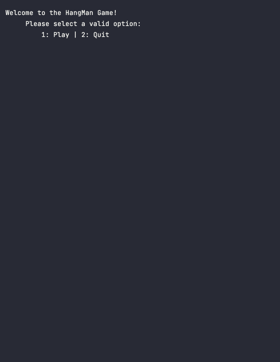

# 🌟 Hangman 🦥 

The HangMan game is my first project in Java with the __Nology course__. The goal of this project was to demonstrate that I clearly understood the **4 Pillars of Object Oriented Programming**. 
I broke down the game in 3 Classes:
- the ```Game Class``` where all the logic happened. 
- the ```Player Class``` where the user could create a new Player, I could use the class to manipulate the lifepoints.
- the ```WordLibrary Class``` where I created the method to randomly select a word. 
 

## ⚙️ Features

- Option to Play or leave the game.
- Options to relaunch a new game without creating a new user profile.
- Emojis 🎉


## 🖥️ Demo

<div align="center">
  
</div>

## 🛠️ Installation 

To run the app locally, please follow these steps:

- Clone the repository to your local machine.
- Run the Main.java file with your own IDE.

## 📚 Usage

To use the app, simply run the main class. Enjoy the game!

## 🧑‍💻 Author

<strong>[@tomas-trls](https://www.github.com/tomas-trls) / tomast25@hotmail.com  </strong>
 :shipit: :godmode:
